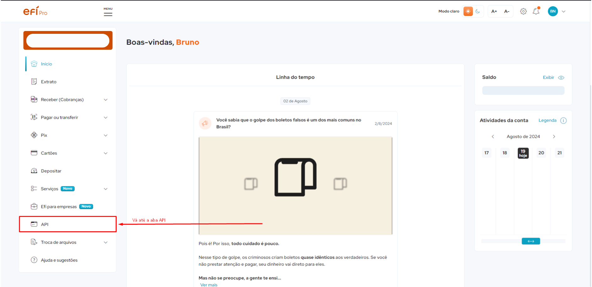
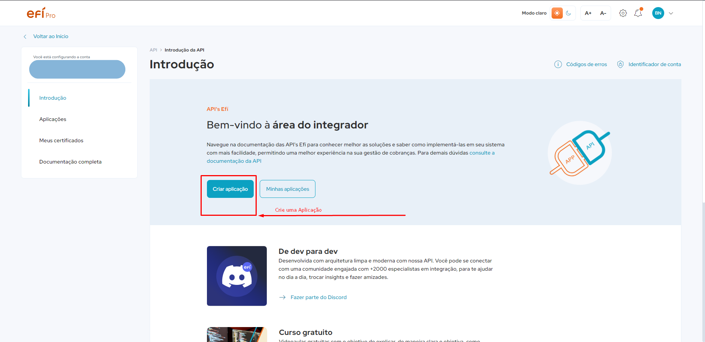
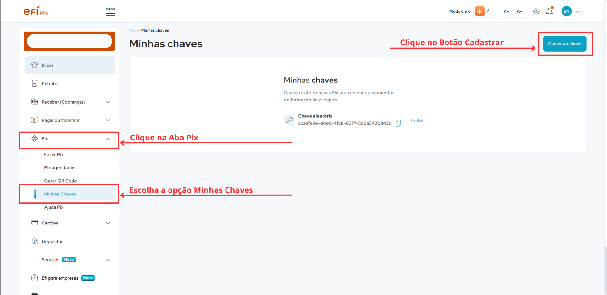

# Gerencianet TypeScript SDK - Integração de Typescript com as APIs Efí Pay

Este pacote oferece uma SDK moderna para integrar a API da Gerencianet com TypeScript. Diferente da SDK oficial, esta versão foi desenvolvida com foco total no TypeScript, proporcionando segurança de tipos e melhor reportagem de erros durante o desenvolvimento.


**Atenção**: O pacote está em desenvolvimento ativo. Atualmente, apenas a API de PIX para cobranças imediatas e cobranças com data limite está com a integração completa. Outras funcionalidades serão implementadas em futuras atualizações.


## Instalação

```bash
npm i @bruno-valero/gerencianet-sdk-typescript
```

## Variáveis de Ambiente (Environment Variables)

As variáveis de ambiente **são obrigatórias** para que o sdk funcione como o esperado. Elas são usadas para informar as **[Credenciais](#credenciais)** necessárias para utilizar as APIs da Efí Pay, para configurá-las siga os passos abaixo:

- Crie um arquivo na raiz do projeto com nome de `.env`.
- Abra o arquivo num editor de texto e armazene as seguintes variáveis de ambiente.

```bash
# CERTIFICATES ********************************************
CERTIFICADO_HOMOLOGACAO_PATH="./path/to/homologacao-certificate.(p12|pem)"
CERTIFICADO_PRODUCAO_PATH="./path/to/producao-certificate.(p12|pem)"

# CREDENTIALS ********************************************
# HOMOLOGACAO
CLIENT_ID_HOMOLOGACAO="Your_Client_Id_for_Homologacao"
CLIENT_SECRET_HOMOLOGACAO="Your_Client_Secret_for_Homologacao"
# PRODUCAO
CLIENT_ID_PRODUCAO="Your_Client_Id_for_Producao"
CLIENT_SECRET_PRODUCAO="Your_Client_Secret_for_Producao"
# PIX
PIX_KEY="you-pix-key-might-be-cpf-watsappNumber-or-randomkey-generated-by-efi-bank"
```

- Se não estiver usando um framework, será necessário instalar o `dotenv` para ter acesso às variáveis de ambiente. Se for o caso, execute:

```bash
npm i dotenv
```

### Validação e Segurança de Tipagem

Para obter maior segurança de tipagem é recomendado criar um arquivo para validar as variáveis de ambiente. Abaixo está um exemplo utilizando a biblioteca `zod`.

**Instale a biblioteca**

```bash
npm i zod
```

**Crie um arquivo com nome `env` e valide as variáveis da seguinte forma:**

```ts
import 'dotenv/config'

import z from 'zod'

const envSchema = z.object({
  // CERTIFICATES
  CERTIFICADO_HOMOLOGACAO_PATH: z
    .string()
    .min(1, 'environment variable "CERTIFICADO_HOMOLOGACAO_PATH" is missing'),
  CERTIFICADO_PRODUCAO_PATH: z
    .string()
    .min(1, 'environment variable "CERTIFICADO_PRODUCAO_PATH" is missing'),
  // CREDENTIALS
  CLIENT_ID_HOMOLOGACAO: z
    .string()
    .min(1, 'environment variable "CLIENT_ID_HOMOLOGACAO" is missing'),
  CLIENT_SECRET_HOMOLOGACAO: z
    .string()
    .min(1, 'environment variable "CLIENT_SECRET_HOMOLOGACAO" is missing'),
  CLIENT_ID_PRODUCAO: z
    .string()
    .min(1, 'environment variable "CLIENT_ID_PRODUCAO" is missing'),
  CLIENT_SECRET_PRODUCAO: z
    .string()
    .min(1, 'environment variable "CLIENT_SECRET_PRODUCAO" is missing'),
  PIX_KEY: z
    .string()
    .min(1, 'environment variable "PIX_KEY" is missing'),
})

const _env = envSchema.safeParse(process.env)

if (!_env.success)
  throw new Error(
    `Environment variables error. Make sure that you have been created a  ".env" file at the root of your project.
    
    Also make sure that all environment variables have been set. See the documentation to learn about the environment variables that is required at "https://www.npmjs.com/package/@bruno-valero/gerencianet-sdk-typescript?activeTab=readme"

    Error details:

    ${JSON.stringify(_env.error.format(), null, 2)}
    `,
  )

export const env = _env.data
```

## Credenciais

Para poder utilizar as APIs da Efí Pay é necessário fornecer algumas credenciais que serão passadas através das **[Variáveis de Ambiente](#variáveis-de-ambiente-environment-variables)**, vamos entender cada uma delas.

### Primeiro Passo -  Criação da Conta

É necessário **[criar uma conta na gerencianet (Efí Pay)](https://sejaefi.com.br/abrir-conta)** para poder obter as credenciais das APIs Efí Pay. **[Assista o vídeo que explica o processo de criação de contas](https://www.youtube.com/watch?v=CrEg9d0hH6Y&list=PLRqvcUTH2VsWufBmzOdTVeLEOTGrPNoiu&index=3)** se necessário.

### Segundo Passo - Criação de um Aplicativo

Para ter acesso às suas credenciais é necessário criar um aplicativo. Ele representa uma conta dentro da Gerencianet que terá acesso às APIs da Efí Pay de forma que você pode ter diversos aplicativos, cada um contendo suas próprias credenciais e representando, por exemplo, um negócio aberto por você.

- Vá até a aba API


- Então crie uma aplicação


Depois de criada, acesse a aba **Aplicações** de suas APIs. Ela listará todas as suas aplicações criadas. Escolha a aplicação que você acabou de criar e então terá acesso às suas credenciais **Client ID** e **Client Secret** de Produção e de Homologação.

Com essas credenciais, alimente as **[Variáveis de Ambiente](#variáveis-de-ambiente-environment-variables)** `CLIENT_ID_HOMOLOGACAO`, `CLIENT_SECRET_HOMOLOGACAO` e `CLIENT_ID_PRODUCAO`, `CLIENT_SECRET_PRODUCAO`

### Terceiro Passo - Criação dos Certificados

Acesse a aba **Meus Certificados** abaixo da aba **Aplicações** e então crie um certificado para Produção e outro para Homologação.

Ao criar um certificado, você receberá um arquivo que deve ser baixado no seu computador, **certifique-se de não perder este arquivo**, pois ele só pode ser baixado no momento da criação do certificado e **não estará disponível para download posteriormente**.

Salve o arquivo am algum lugar dentro do seu projeto e após fazer isso alimente as **[Variáveis de Ambiente](#variáveis-de-ambiente-environment-variables)** `CERTIFICADO_HOMOLOGACAO_PATH` e `CERTIFICADO_PRODUCAO_PATH` com o caminho do arquivo onde você salvou os certificados, exemplo: `"./src/certificados/homologacao.p12"`.


### Quarto Passo - Criação da Chave Pix

Para receber uma transação PIX é necessário criar uma chave PIX, que pode ser seu **CPF**, **Número de Celular**, **Email** ou uma **Chave Aleatória**. 

Entre em sua conta da Efí Pay, vá até a aba **Pix** e escolha a opção **Minhas Chaves** então clique no botão **Cadastrar Chave**, escolha o tipo de chave, exemplo *CPF*, *Email*, etc. Por fim alimente a **[Variável de Ambiente](#variáveis-de-ambiente-environment-variables)** `PIX_KEY` com o valor de sua chave.



**Após cumprir estes passos, todas as credenciais necessárias para o funcionamento do sdk estão configuradas.**


## Utilização do SDK

Para utilizar o SDK integrado ao typescript, basta importá-lo no arquivo e instanciar a classe `EfiPay` passando como parâmetro o tipo da conexão que pode ser `"PRODUCTION"` ou `"SANDBOX"`, da seguinte forma:

```ts
import EfiPay from '@bruno-valero/gerencianet-sdk-typescript'

const efi = new EfiPay('SANDBOX')
```

- Tipo "PRODUCTION": É a conexão com as APIs de Produção, ou seja, destinado a transações financeiras reais
- Tipo "SANDBOX": É a conexão com as APIs de Homologação, ou seja, destinado a transações financeiras fictícias

### API PIX

A API PIX da Efí Pay é destinada a realizar transações financeiras através de PIX, ela tem duas modalidades integradas até então, que são, **Cobranças imediatas** e **Cobranças com vencimento** que possuem quatro métodos, `create`, `update`, `findUnique` e `findMany`. 

#### Cobranças imediatas - **imediateCharge**

Responsável pela gestão de cobranças imediatas. As cobranças, no contexto da API Pix representam uma transação financeira entre um pagador e um recebedor, cuja forma de pagamento é o Pix.

---

- **Testes de Integração Realizados**

---

Para entender mais sobre as **cobranças imediatas**, leia as anotações typescript do SDK ou [visite a documentação oficial](https://dev.efipay.com.br/docs/api-pix/cobrancas-imediatas)

Para utilizar as **cobranças imediatas** através do SDK acesse a propriedade `imediateCharge` da api PIX, dessa forma:

```ts
import EfiPay from '@bruno-valero/gerencianet-sdk-typescript'

const efi = new EfiPay('SANDBOX')

efi.pix.imediateCharge.create({
  // passe os parâmetros necessários
})
efi.pix.imediateCharge.update({
  // passe os parâmetros necessários
})
efi.pix.imediateCharge.findUnique({
  // passe os parâmetros necessários
})
efi.pix.imediateCharge.findMany({
  // passe os parâmetros necessários
})
```

#### Cobranças com vencimento - **dueCharge**
Responsável pela gestão de cobranças com vencimento. As cobranças, no contexto da API Pix, representam uma transação financeira entre um pagador e um recebedor, cuja forma de pagamento é o Pix.

---

- **Testes de Integração Realizados**

---

Para entender mais sobre as **cobranças com vencimento**, leia as anotações typescript do SDK ou [visite a documentação oficial](https://dev.efipay.com.br/docs/api-pix/cobrancas-com-vencimento)

Para utilizar as **cobranças com vencimento** através do SDK acesse a propriedade `dueCharge` da api PIX, dessa forma:

```ts
import EfiPay from '@bruno-valero/gerencianet-sdk-typescript'

const efi = new EfiPay('SANDBOX')

efi.pix.dueCharge.create({
  // passe os parâmetros necessários
})
efi.pix.dueCharge.update({
  // passe os parâmetros necessários
})
efi.pix.dueCharge.findUnique({
  // passe os parâmetros necessários
})
efi.pix.dueCharge.findMany({
  // passe os parâmetros necessários
})
```

#### Envio e Pagamento Pix - **sendAndPayment**

Traz as funcionalidades disponíveis para a gestão do Envio de Pix e do Pagamento de QR Codes Pix

---

- **Testes de Integração *Não Realizados***

---

Para entender mais sobre as **envio e pagamento pix**, leia as anotações typescript do SDK ou [visite a documentação oficial](https://dev.efipay.com.br/docs/api-pix/envio-pagamento-pix)

Para utilizar as **envio e pagamento pix** através do SDK acesse a propriedade `sendAndPayment` da api PIX, dessa forma:

```ts
import EfiPay from '@bruno-valero/gerencianet-sdk-typescript'

const efi = new EfiPay('SANDBOX')

efi.pix.sendAndPayment.send({
  // passe os parâmetros necessários
})
```

#### Webhooks - **webhooks**

Gerenciamento de notificações por parte do PSP recebedor a pessoa usuária recebedora.

---

- **Testes de Integração Realizados**

---

Para entender mais sobre as **webhooks**, leia as anotações typescript do SDK ou [visite a documentação oficial](https://dev.efipay.com.br/docs/api-pix/webhooks)

Para utilizar as **webhooks** através do SDK acesse a propriedade `webhooks` da api PIX, dessa forma:

```ts
import EfiPay from '@bruno-valero/gerencianet-sdk-typescript'

const efi = new EfiPay('SANDBOX')

efi.pix.webhooks.add({
  // passe os parâmetros necessários
})

efi.pix.webhooks.findUnique({
  // passe os parâmetros necessários
})

efi.pix.webhooks.findMany({
  // passe os parâmetros necessários
})

efi.pix.webhooks.delete({
  // passe os parâmetros necessários
})
```


#### Gestão de Pix - **manage**

Gestão das transações Pix, isto é, a manutenção dos recebimentos e devoluções Pix.

---

- **Testes de Integração *Não Realizados***

---

Para entender mais sobre as **gestão de pix**, leia as anotações typescript do SDK ou [visite a documentação oficial](https://dev.efipay.com.br/docs/api-pix/gestao-de-pix)

Para utilizar as **gestão de pix** através do SDK acesse a propriedade `manage` da api PIX, dessa forma:

```ts
import EfiPay from '@bruno-valero/gerencianet-sdk-typescript'

const efi = new EfiPay('SANDBOX')

efi.pix.manage.consult({
  // passe os parâmetros necessários
})

efi.pix.manage.consultMany({
  // passe os parâmetros necessários
})

efi.pix.manage.return({
  // passe os parâmetros necessários
})

efi.pix.manage.consultReturn({
  // passe os parâmetros necessários
})
```

